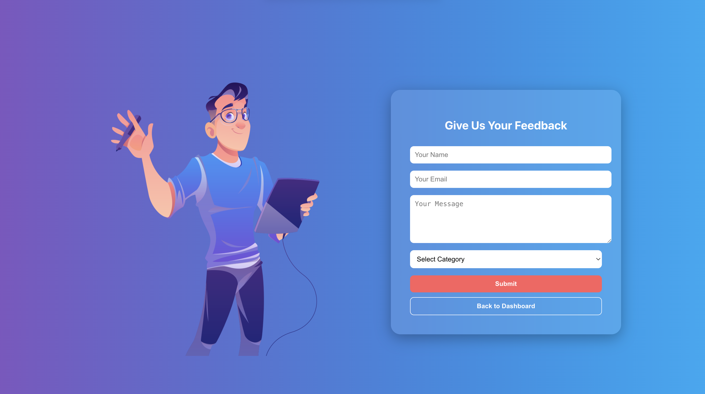
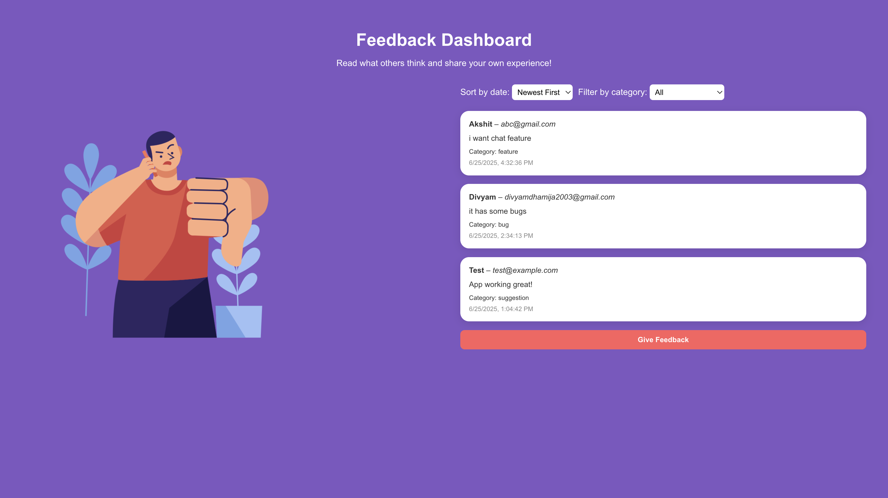

# 📬 Feedback System

A full-stack feedback collection web app built using **MERN Stack (MongoDB, Express.js, React.js, Node.js)**. Users can submit feedback based on categories, and view existing feedbacks. Includes smooth Lottie animations and real-time backend communication.

---

## 🔧 Tech Stack

**Frontend:**
- React.js
- Axios
- Lottie Files


**Backend:**
- Node.js
- Express.js
- MongoDB with Mongoose

---

## 📁 Folder Structure
feedback/
├── BACKEND/
│   ├── models/
│   │   └── feedback.js
│   ├── routes/
│   │   └── feedback.js
│   ├── app.js
│   └── …
├── FRONTEND/
│   ├── src/
│   │   ├── components/
│   │   │   └── FeedbackForm.js
│   │   └── App.js
│   └── …
└── README.md


---

## 🚀 Getting Started

### Clone the repo

```bash
git clone https://github.com/divyam110903/feedback.git
cd feedback-system


cd BACKEND
npm install

cd ../FRONTEND
npm install

THEN IN ROOT DIRECTORY 
In the root package.json, add:
"scripts": {
  "client": "cd FRONTEND && npm start",
  "server": "cd BACKEND && npx nodemon app.js",
  "start": "concurrently \"npm run server\" \"npm run client\""
}

npm install --save-dev concurrently
RUN :npm start

## 📷 Screenshots

### 🖼️ Feedback Form with Lottie Animation


### 📋 Feedback List View

